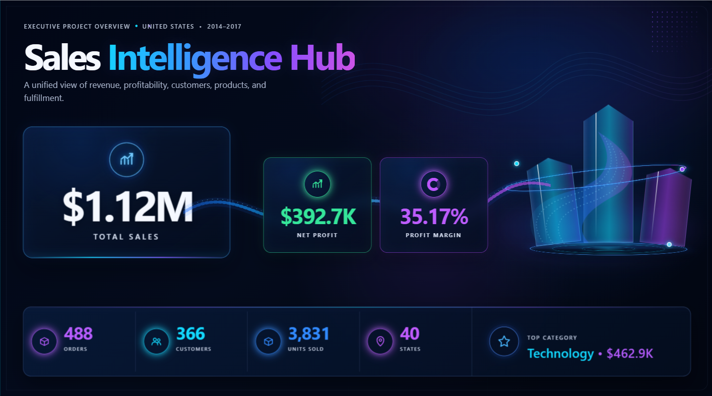
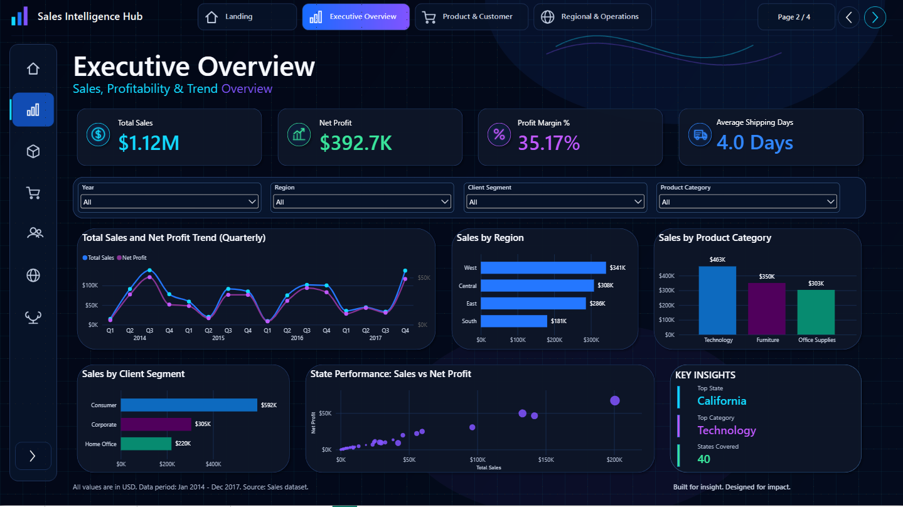
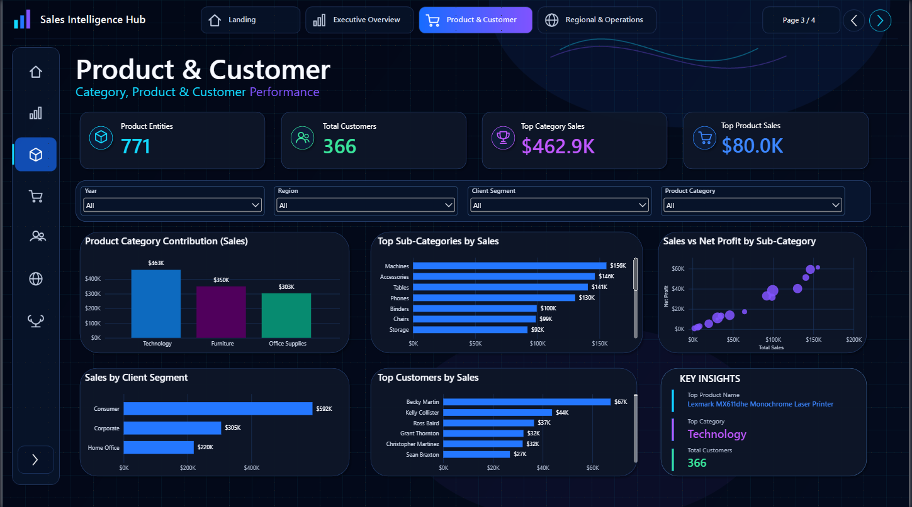
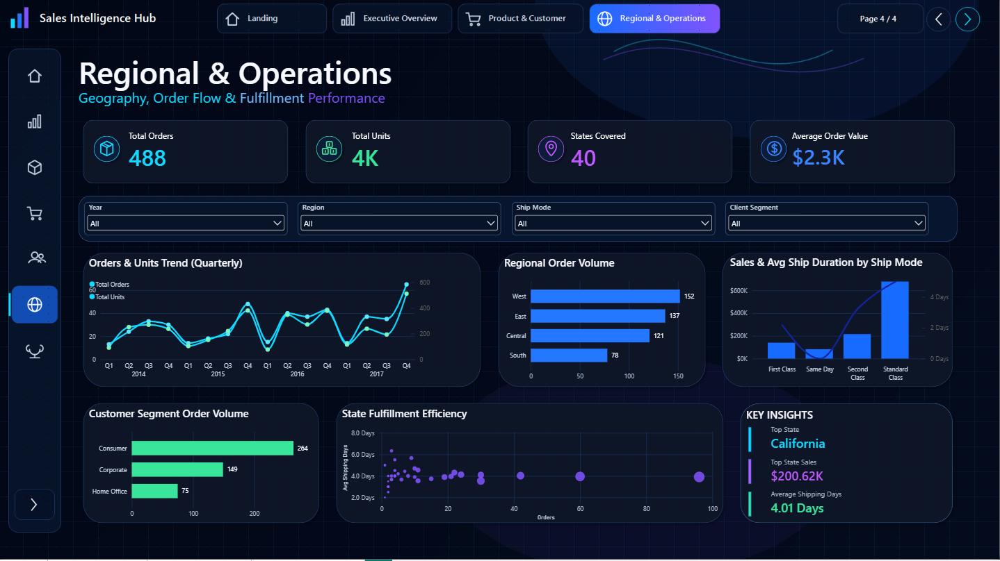

# Sales Intelligence Hub

An end-to-end sales analytics project combining Python, SQL Server, Excel, Power Query, and Power BI. The project cleans and validates transactional data, analyses sales and profitability performance, and presents the findings through an interactive four-page dashboard.

  

> Screenshots are from the completed Power BI report. Open the `.pbix` file to explore the interactive filters and navigation.

## Decision focus

Provide leadership with a clear view of sales, profitability, customer contribution, regional performance, and fulfilment efficiency to support better commercial decisions.

## Business questions

- How are sales and profit changing over time?
- Which regions, states, categories, and products drive performance?
- Which customer segments contribute the most revenue?
- How efficiently are orders fulfilled across shipping modes?
- Where should management focus to improve growth and profitability?

## Key results

| KPI | Result |
|---|---:|
| Total sales | $1,116,515.01 |
| Net profit | $392,651.11 |
| Profit margin | 35.17% |
| Orders | 488 |
| Customers | 366 |
| Units sold | 3,831 |
| States covered | 40 |
| Average shipping duration | 4.01 days |

Additional findings:

- The West is the leading region with $341.2K in sales.
- Technology is the top category with $462.9K in sales.
- The Consumer segment contributes $591.6K in sales.
- California is the highest-performing state with $200.6K in sales.

## Recommended actions

- Track sales and margin together, particularly across the leading West region and Technology category.
- Investigate state-level performance exceptions early to identify underperforming markets.
- Monitor fulfilment time by region and product group to help protect customer experience.

## Dashboard pages

### Executive Overview

### Product and Customer Analysis

### Regional and Operations Analysis

## Tools and techniques

- **Power BI:** interactive dashboard, KPI cards, slicers, navigation, drill-through, DAX, and data modelling
- **Python:** data cleaning, validation, exploratory data analysis, and visualisation using Pandas, NumPy, Matplotlib, and Seaborn
- **SQL Server:** analytical queries, aggregations, KPI views, and reporting-layer analysis
- **Power Query:** data transformation and preparation for the Power BI model
- **Excel:** raw and cleaned datasets plus analysis output

## Repository contents

| File / Folder | Description |
|---|---|
| `Sales.ipynb` | Python data cleaning and exploratory analysis notebook |
| `Sales Analysis.sql` | SQL Server analysis queries and KPI views |
| `Sales_Intelligence_Dashboard.pbix` | Interactive Power BI dashboard |
| `Sales_Data.xlsx` | Raw source dataset |
| `Clean Sales data.xlsx` | Cleaned and validated dataset |
| `Sales_Analysis_Report.xlsx` | Excel analysis output |
| `Screenshots/` | Screenshots from the completed Power BI report |

## SQL setup

The SQL scripts target Microsoft SQL Server and use a database named `SalesIntelligence`. Import the cleaned workbook into a table named `dbo.SalesData`, then run the queries using SQL Server Management Studio or the MSSQL extension for VS Code.

## Author

**Aryan Aher**

- [LinkedIn](https://www.linkedin.com/in/aryanraher/)
